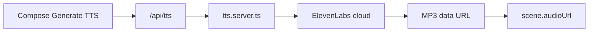
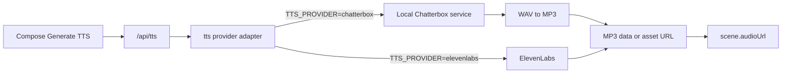

# Chatterbox in place of ElevenLabs

Saved for later — do not implement until we pick this back up.

**Overview:** What changes if divStudio swaps ElevenLabs TTS for free open-source Chatterbox (Resemble AI), and the concrete integration process — without changing STT or Compose UI contracts yet.

## What you have today

Compose narration TTS is centered on `src/lib/tts.server.ts`:

- Cloud call to ElevenLabs (`eleven_v3`, Liam voice, `mp3_44100_128`)
- Returns `data:audio/mpeg;base64,…`
- Compose UI probes duration and stores `audioUrl` on the scene

Same key (`ELEVENLABS_API_KEY`) also powers **STT** (`/api/transcribe`, reveal sync, recording2 voice replace). Chatterbox is **TTS only** — it does not replace speech-to-text.

## What “integrate Chatterbox” means

**Chatterbox** = Resemble AI’s MIT-licensed open-source TTS (local or self-hosted). Free to run commercially; you pay in **machine time** (CPU/GPU), not per character. Managed Resemble cloud is optional and not free.

If TTS switches to Chatterbox and the rest of the app stays the same:

| Area | What happens |
|------|----------------|
| **Cost** | ElevenLabs TTS character fees go away. You need a machine that can run the model (GPU preferred; CPU possible but slower). |
| **Compose UI** | No user-facing change if we keep the same `/api/tts` → `{ audioUrl }` contract. |
| **Audio format** | Chatterbox typically outputs **WAV**. We convert/encode to **MP3** (or serve WAV) so VideoPlayer / export keep working. |
| **Voice** | No Liam voice ID. You pick a **reference WAV** (zero-shot clone) or a fixed local voice profile. |
| **Emotion tags** | Scripts today use ElevenLabs-style tags (`[excited]`, `[curious]`, `[chuckles]`). Chatterbox-Turbo uses a **different** tag set (e.g. `[laugh]`, `[chuckle]`) plus an `exaggeration` knob. Tags would need a **mapper** or script-prompt update — raw ElevenLabs tags may be spoken aloud or ignored. |
| **Latency** | Local generate can be slower on first load (model download) and on long scripts; batch/chunk long narrations. |
| **STT / sync / voice-replace** | Still need ElevenLabs (or Whisper / another STT). Free Chatterbox ≠ free full audio stack. |
| **Offline / privacy** | Narration text and audio can stay on your Mac if self-hosted — good for course content. |
| **Watermark** | Open Chatterbox often embeds Resemble’s PerTh watermark by default — usually fine for course video. |

## Recommended process (if you decide to do it)

1. **Run Chatterbox as a side service** (not inside the Vite Node process). Typical options: `pip install chatterbox-tts` + small FastAPI/Flask server, or [chatterbox-tts-api](https://github.com/travisvn/chatterbox-tts-api) (OpenAI-compatible `/v1/audio/speech` on something like `localhost:4123`).
2. **Add a TTS provider adapter** in `src/lib/tts.server.ts` behind `TTS_PROVIDER=elevenlabs|chatterbox` so Compose, mark/intro defaults, and recording2 phrase TTS all share one path.
3. **Normalize output** to the current contract: MP3 (or keep WAV if we widen players) + same `{ audioUrl }` response from `/api/tts`.
4. **Voice setup**: drop one tutor reference clip (e.g. 5–10s clean WAV) into `.data/` and pass it as Chatterbox `audio_prompt_path`.
5. **Emotion tags**: either map `[excited]`→exaggeration/`[chuckle]`, or update part-script AI prompts to Chatterbox-native tags.
6. **Keep STT separate** for now (ElevenLabs or later Whisper) so reveal schedules and recording2 replace keep working.
7. **Pilot** on one scene (Episode 1 Part 1 intro) before flipping the default.

## What would *not* change

- Course / episode / part / Script tab data model
- Scene export / stitch pipeline (as long as audio URL + duration still work)
- Need for `probeAudioDurationMs` on the client

## Practical caveat

“Chatterbox is free” is true for the **model license**. End-to-end free only if you also replace **STT** and accept **local hardware** cost/complexity. A thin adapter + local service is the lowest-risk path; a full delete of ElevenLabs is a larger second phase.

## Out of scope for a first integration

- Replacing ElevenLabs STT
- Rewriting all existing scripts’ emotion tags in the DB
- Shipping a cloud Chatterbox SaaS billing path
